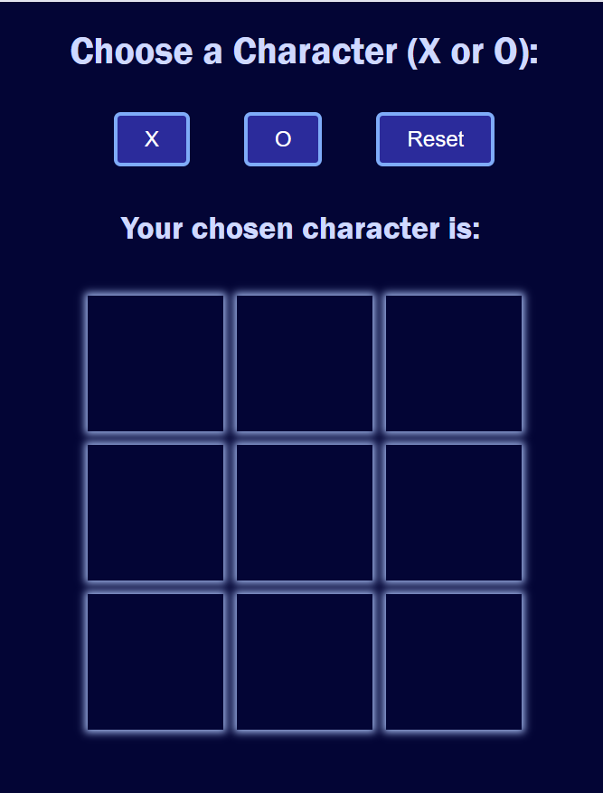

# tic-tac-toe-js
Simple Tic Tac Toe Game built with vanilla JavaScript, HTML, and CSS. This project demonstrates core JavaScript skills including DOM manipulation, event handling, array operations, conditional logic, and basic game state management. Built without any libraries or frameworks to practice pure JavaScript fundamentals.

## Live Demo

[Check out the project here](https://aaron-k17.github.io/tic-tac-toe-js/)
